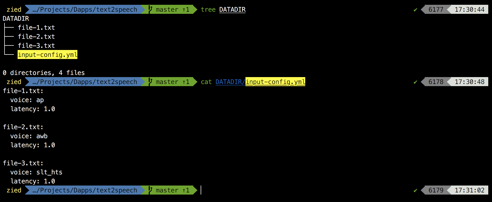

## Description

text2speech is an Ethereum ready dapp that uses [mimic](https://github.com/MycroftAI/mimic) text-to-speech engine to convert text files to speech and save them in wav format.  


## Usage

Bring your text files together in a folder (exp: DATADIR) and add an ```input-config.yml``` file in the same folder. This configuration defines parameters for each text to be pronounced and it should respect the following format:

    <imagename 1>:
        voice: <voice name>
        latency: <value>
    <imagename 2>:
        voice: <voice name>
        latency: <value>

You can keep voice and latency values empty the app will use default values ("ap" as voice and 1.0 as latency).



In the ```app/app-config.yml``` file, change the datadir parameter to the path of your folder (DATADIR for our example) and run the script.

    $ git clone https://github.com/Zied-Guesmi/text2speech.git && cd text2speech/
    $ sed -i "s/\/iexec/<path/to/datadir/folder>/" app/app-config.yml
    $ python3 app/src/app.py

You shoud find your speech files in the ```DATADIR/out/``` folder.


## Supported languages

English (for now).


## Voices

**Male**: ap, awb_time, awb, kal, kal16, rms.  
**Female**: slt_hts, slt.  
See voice samples [here](https://github.com/Zied-Guesmi/text2speech/tree/master/voice-samples).


## Dependencies

- [python3](https://www.python.org/)  
- [mimic](https://github.com/MycroftAI/mimic) tts engine


## Docker installation

After installing [docker](https://docs.docker.com/install/) and preparing your DATADIR folder, just grab the docker image from dockerhub and run it

    $ docker run -v abs/path/to/datadir:/iexec/ ziedguesmi/text2speech

Or you can build your own image from dockerfile:

    # clone the dapp
    $ git clone https://github.com/Zied-Guesmi/text2speech.git && cd text2speech/ 

    # build the docker image
    $ docker build -t text2speech .

    # run the container
    $ docker run -v abs/path/to/datadir:/iexec/ text2speech


## Installation

Install system dependencies:

    # ubuntu as an example
    $ apt-get update && apt-get install -y \
        automake \
        gcc \
        git \
        libasound2-dev \
        libsm6 \
        libtool \
        make \
        pkg-config \
        python3 \
        python3-pip \
        unzip \
        wget

Install mimic tts engine

    $ git clone https://github.com/MycroftAI/mimic.git && cd mimic
    $ ./dependencies.sh --prefix="/usr/local"
    $ ./autogen.sh
    $ ./configure --prefix="/usr/local"
    $ make

Clone the app:

    $ git clone https://github.com/Zied-Guesmi/text2speech.git

Install python depedencies:

    $ cd text2speech/app/
    $ pip3 install -r requirements.txt


## TODO

- Support more languages.
- Add more mimic voices.
- Reduce mimic docker image size.


## Authors

- **[Zied Guesmi](https://github.com/Zied-Guesmi)**


## License

This project is licensed under the MIT License - see the [LICENSE](https://github.com/Zied-Guesmi/text2speech/blob/master/LICENSE) file for details